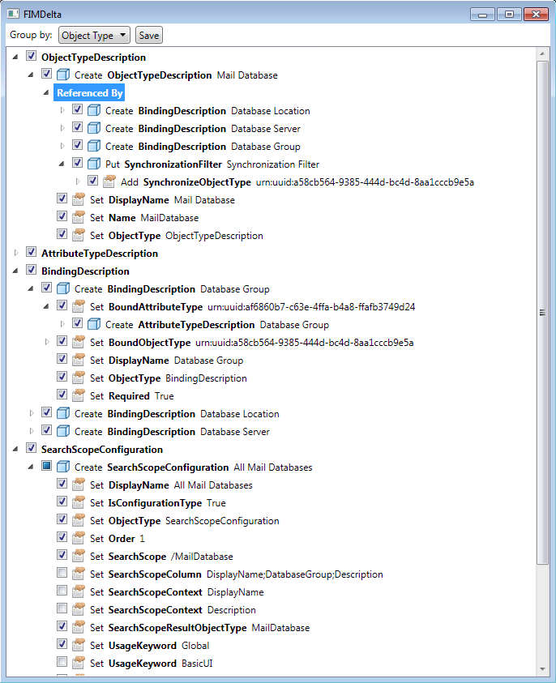

# FIMDelta

Helper utility to selectively apply changes between development and production FIM2010 servers. 

## Usage

After exporting configurations from source and target environments using the `ExportConfig.ps1` and generating a changes file with `DiffConfig.ps1`, run the utility and specify the source, target, and changes XML files. Scripts can be found in the build directory.

Utility will show you all objects in delta as a tree. You can group it either by operation, or by object type.

Just check/uncheck objects or single attributes you want to export/skip, and save your changes. Process the saved changes with `CommitChanges.ps1`.

The killer feature is reference tracking. If attribute is a reference, it will have referenced objects in a subtree. And if object is referenced by some attribute, it will have "Referenced by" node with all objects referencing it.
